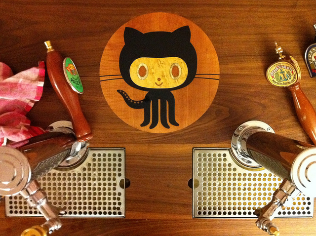
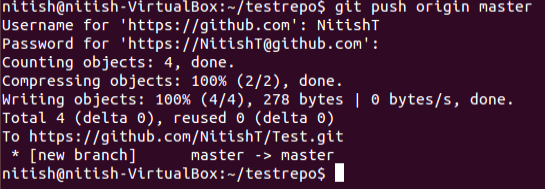
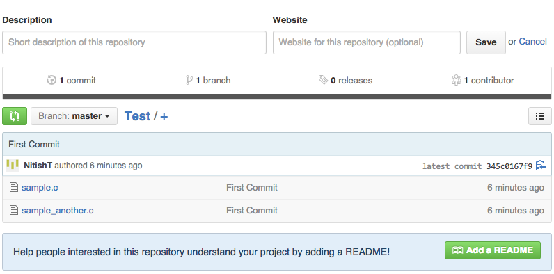

Title: GitHub: A beginner's guide, Part II
Date: 2015-08-04 09:52
Category: General
Author: Nitish Tiwari
Email: tiwari.nitish@gmail.com
Summary:  This is the second post in the series on GitHub: A beginner’s guide. In the previous post we learnt about Git basics and some of its most important commands. Now, we will take a look at steps to create your own repo on a Linux box (with the master on GitHub). I assume you already have your GitHub account and a repo created. If not, you can do that using the steps mentioned here. Note that if you are on Mac or Windows machines, GitHub has desktop applications for both. After you download the desktop application, you can push code to your repo using the steps mentioned here. But if you are on a Linux box, you will need to install Git and then configure it to use your GitHub repo.


<small>Photho by [Tim Lucas](https://www.flickr.com/photos/toolmantim/ "Tim Lucas profile at Flickr"){target="_blank"} ([CC-BY 2.0](https://creativecommons.org/licenses/by/2.0/ "Creative Commons - Attribution 2.0 Generic (CC BY 2.0)"){target="_blank"})</small>

This is the second post in the series on GitHub: A beginner’s guide. In the [previous post](/github-a-beginners-guide-part-i.html "See 'GitHub: A beginner's guide, Part I'") we learnt about Git basics and some of its most important commands. Now, we will take a look at steps to create your own repo on a Linux box (with the master on GitHub). I assume you already have your GitHub account and a repo created. If not, you can do that using the steps mentioned [here](https://help.github.com/articles/create-a-repo/ "Create a repo in GitHub"){target="_blank"}. Note that if you are on Mac or Windows machines, GitHub has a [desktop application](https://desktop.github.com/ "GitHub desktop"){target="_blank"} for both. After you download the desktop application, you can push code to your repo using the steps mentioned [here](https://guides.github.com/introduction/getting-your-project-on-github/#desktop "Getting started with GitHub Desktop"){target="_blank"}. But if you are on a Linux box, you will need to install Git and then configure it to use your GitHub repo.

Coming to the agenda i.e. repo on a Linux box, the first point to understand is that GitHub is built around Git, i.e. GitHub provides you a wrapper to manage your files while using Git in the background (not to forget, GitHub also provides the web server, so anyone can access their code from anywhere). So, Git commands work perfectly well on GitHub. I have used Ubuntu as my base system, (you may need to use other commands based on the distro you use).

**1.** Install and download Git:
```
sudo apt-get install git
```
**2.** Configure git with your GitHub details.
```
git config --global user.name "username"
git config --global user.email "email@domain.com"
```
**3.** Create local repo: Suppose you have your source code available in the path *~/my_awesome_project* (if you are yet to write the source code, just create the folder *my_awesome_project* for now). Go to your home folder and type ­
```
git init my_awesome_project
```
**4.** Adding files to git: Now just add the files in your source code folder to git (buffer) using the add command. Note that you can also add folders using this command, and this needs to be done only once in the life of the file. That means, if you have a new file/folder in your source code, you need to add it just once. For example, I take two files here ­
```
git add sample.c
git add sample_another.c
```
**5.** Commit the changes: Now that files are added to git, you need to commit them. This saves the state of the file in git, and you can revert to this state at any point in time later.
```
git commit -m "some message"
```
**6.** Pushing local files to GitHub repo: If you noticed, we have till now not contacted GitHub. All the changes & commits were done locally, to make sure these changes are pushed to the server, you need to use the push command. But before that, you need to set the path of your remote repo. You can find the path in GitHub repo page. It should look something like *https://github.com/User_Name/Repo_Name.git*. Add the path using
```
git remote add origin https://github.com/User_Name/Repo_Name.git
```
**7.** Finally push the code using
```
git push origin master
```
Here is how this looks


<small>Local repository example</small>
  

<small>Github repository example</small>
